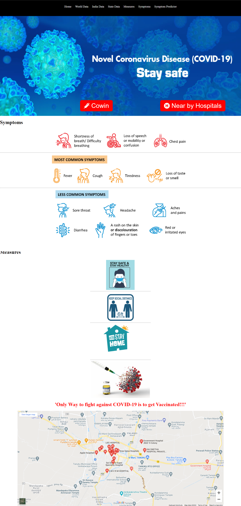

### Simple Corona virus status Website using covid api

### Website Link
Link : https://covid-19-data-status.herokuapp.com/

Covid - 19 Symptom Predictor : 
* github :  https://github.com/Datta2901/Covid_19_Symptom_Predictor

### Features:
### By using this website one can view the real time status of corona virus cases of

> * World data(Individual Countries)
> 
> * India data(Individual States)
> 
>  * State data(Individual Districts)
> 
> * We can see measures , symptoms of covid 19

# Used Laguages:
> * Html
> 
> *  php
> 
> * css

# Different  Api 's:
world data
> https://api.covid19api.com/summary

State data
> https://api.covid19india.org/data.json
> 
District data
> https://api.covid19india.org/state_district_wise.json

# Sample Front End :

## Home Page

## World Data Page:

## India Data Page:

## State Data Page:

## District/Union Territory Data Page:

## Covid 19 predictor home page:

## Covid positive result page:

## Covid negative result page:

